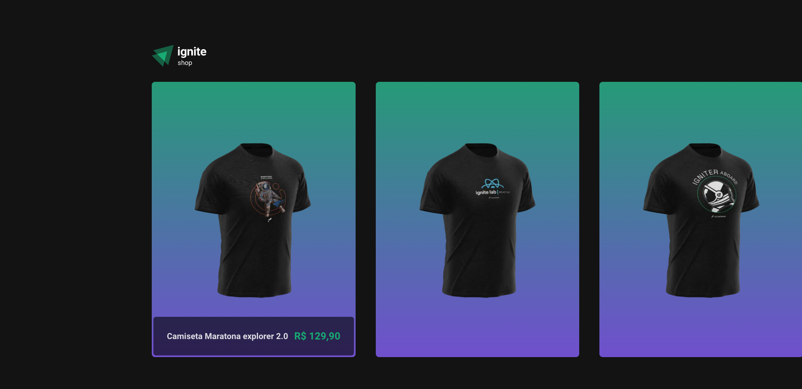
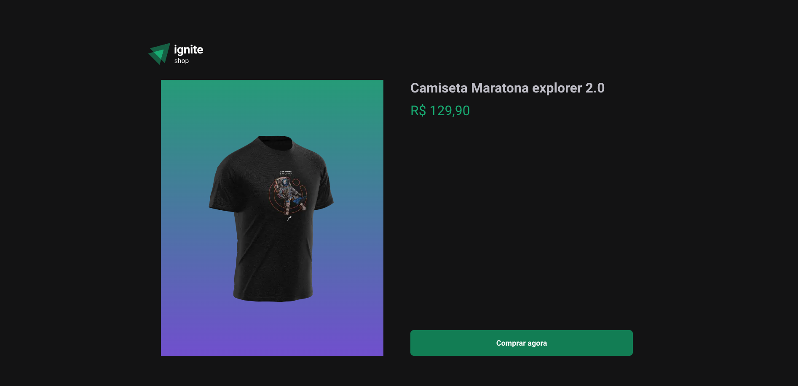
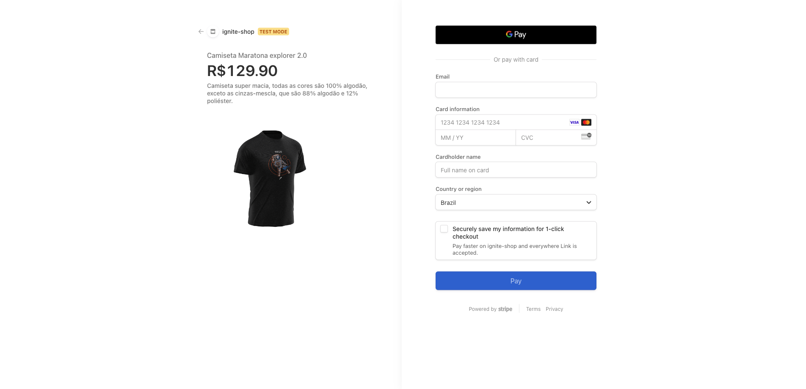

## `Index`

<a href="#About-the-APP">1. About the APP</a> <br />
<a href="#Technology-used">2. Technology used</a> <br />
<a href="#How-to-download-the-project">4. How to download the project</a><br />
<a href="#Final-result">5. Final result</a>


## About the APP

Today I'm bringing here a small project that I did myself, just to put my knowledge into practice with Next.js and Stripe integration.

---

## Technology used

The project was developed using the technology:

- Next.js
- typescript
- axios
- stitches
- stripe (https://stripe.com/en-br)

## How to download the project


```bash

  # Clonar o repositório
  $ git clone https://github.com/DevTeles/ignite-shop

  # Entrar no diretório
  $ cd ignite-shop

  # Instalar as dependências
  $ npm install

  # Configurar as variáveis de ambiente do Stripe (.env.example)

  # Iniciar o projeto
  $ npm run dev
```

## Final result

<h1 align="center">
  Home
  <br /> <br />
  
  <br />
</h1>

<h1 align="center">
  Details
  <br /> <br />
  
  <br />
</h1>

<h1 align="center">
  Checkout
  <br /> <br />
  
  <br />
</h1>


<br /><br />
Developed by **Rafael Teles Vital**
